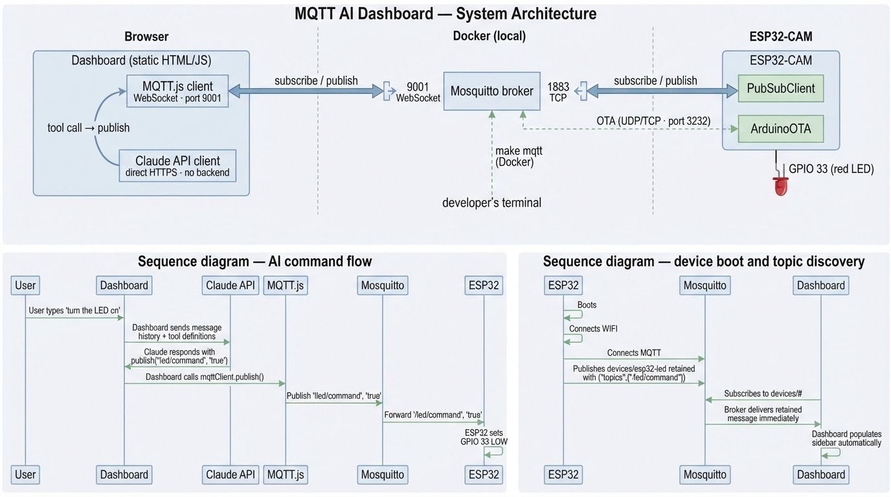

# MQTT AI Dashboard

Browser dashboard for controlling physical robots with AI. The AI chat runs entirely in the browser — no backend, no MCP server, no Python required.

## Architecture

The browser runs everything: MQTT.js connects to a broker over WebSocket. The AI model is called directly from the browser with MQTT tool definitions, and when it responds with a tool call, the dashboard publishes to the broker. The ESP32 subscribes to the same broker over TCP.

By default both sides connect to a public cloud broker — no Docker or local setup needed.



## Prerequisites

- [Homebrew](https://brew.sh/) — to install host dependencies
- One of the following for the AI chat:
  - Anthropic API key — entered in the dashboard settings
  - GitHub account — sign in via GitHub Models (no API key needed)
  - Claude Code subscription — run `make proxy` to use your personal account

## Quickstart

**1. Install host dependencies** (once per machine)
```bash
make setup
```
After install, macOS will prompt you to allow the CP210x driver in **System Preferences > Privacy & Security**. Do that before flashing.

**2. Configure credentials** (first time only)
```bash
cp config.mk.example config.mk
```
Edit `config.mk` with your WiFi SSID and password. `PORT` and `MQTT_IP` are auto-detected — only override them if needed.

**3. Flash firmware** (first time, via USB)
```bash
make flash
```
After boot, the ESP32 prints its unique topic (e.g. `devices/d4e9f4a2a044/led/command`) and its local IP. Add the IP to `config.mk` as `ESP32_IP` to enable OTA updates.

**4. Open the dashboard**

Go to [neevs.io/mqtt-ai](https://neevs.io/mqtt-ai) and click **Connect** — it defaults to the public HiveMQ broker, the same one the ESP32 connects to. Topics appear automatically.

**5. Control your robot**

Browse topics and publish manually, or open the AI chat panel, choose your AI provider, and describe what you want the robot to do.

## OTA updates

After the first USB flash, subsequent firmware updates go over WiFi:

```bash
make ota
```

Requires `ESP32_IP` set in `config.mk` (printed by the ESP32 on boot).

## Local broker (optional)

For offline use or private data, run a local Mosquitto broker:

```bash
make mqtt
```

`MQTT_IP` is auto-detected from your local interface (`en0`). Override it in `config.mk` only if your network interface differs:
```
MQTT_IP = 192.168.1.x
```

Then connect the dashboard to `ws://<your local IP>:9001` (or `ws://localhost:9001` with `make preview`).

## Local Claude proxy (optional)

To use the AI chat with your Claude Code subscription instead of an API key:

**1. Copy the env template and fill in your OAuth token**
```bash
cp .env.example .env
```
Set `CLAUDE_CODE_OAUTH_TOKEN` in `.env` to your Claude Code OAuth token.

**2. Start the proxy**
```bash
make proxy
```

This starts a local proxy at `http://127.0.0.1:7337` that forwards requests directly to `api.anthropic.com` using your OAuth token. Select **Claude · Personal account** as the model in dashboard settings.

## Repo structure

```
dashboard/       Static web app — AI chat + MQTT topic browser
docker/          Mosquitto config for local broker (optional)
firmware/        ESP32 Arduino sketch — LED control via MQTT, OTA support
local-proxy.js   Node.js proxy — forwards AI chat to api.anthropic.com via OAuth (make proxy)
.env.example     Template for CLAUDE_CODE_OAUTH_TOKEN (copy to .env)
Makefile         make setup          — install host dependencies (once per machine)
                 make flash          — compile and upload firmware over USB (first time)
                 make flash-monitor  — flash then open serial monitor
                 make ota            — upload firmware over WiFi (requires ESP32_IP)
                 make monitor        — open serial console
                 make mqtt           — start local Mosquitto broker (optional)
                 make preview        — serve dashboard at http://localhost:8080
                 make proxy          — start local Claude proxy at http://127.0.0.1:7337
```

## Notes

The dashboard also registers MQTT tools via the [W3C WebMCP spec](https://github.com/webmachinelearning/webmcp) (`navigator.modelContext`), which exposes them to native browser AI agents. This requires Chrome 146+ Canary with `chrome://flags/#webmcp-for-testing`. The AI chat works without this — it's an optional enhancement.
