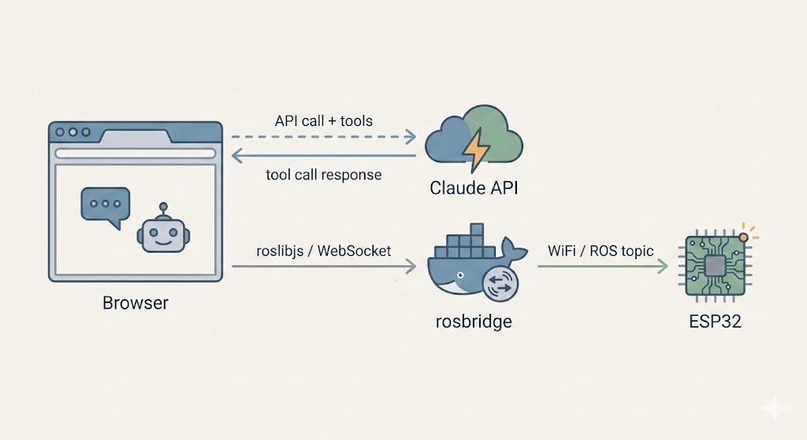

# MQTT AI Dashboard

Browser dashboard for controlling physical robots with AI. Runs entirely in the browser — no backend, no server, no Python.

## Architecture

```
Browser  ──WebSocket──  MQTT Broker  ──TCP──  ESP32
AI chat + topic browser                       firmware
```

The AI model is called directly from the browser using MQTT tool definitions. When it responds with a tool call, the dashboard publishes to the broker. The ESP32 subscribes on the other end.

Both sides use a public HiveMQ broker by default — no local setup needed.



## Prerequisites

- ESP32 dev board with CP210x USB-to-serial (e.g. ESP32-DevKitC)
- [Homebrew](https://brew.sh/) — to install host dependencies
- One of the following for the AI chat:
  - Anthropic API key — entered in the dashboard settings
  - GitHub account — sign in via GitHub Models (no API key needed)
  - Claude Code subscription — run `make proxy` to use your personal account

## Quickstart

**1. Install host dependencies** (once per machine)
```bash
make setup
```
After install, macOS will prompt you to allow the CP210x driver in **System Preferences > Privacy & Security**. Do that before flashing.

**2. Configure credentials** (first time only)
```bash
cp config.mk.example config.mk
```
Edit `config.mk` with your WiFi SSID and password. `PORT` is auto-detected — only override it if needed.

**3. Flash firmware** (first time, via USB)
```bash
make flash-monitor
```
After boot, the ESP32 prints its unique topic (e.g. `devices/d4e9f4a2a044/led/command`) and its local IP. Add the IP to `config.mk` as `ESP32_IP` to enable OTA updates.

**4. Open the dashboard**

Go to [neevs.io/mqtt-ai](https://neevs.io/mqtt-ai) (or run `make preview` for localhost:8080) and click **Connect** — it defaults to the public HiveMQ broker, the same one the ESP32 connects to. Topics appear automatically.

**5. Control your robot**

Browse topics and publish manually, or open the AI chat panel, choose your AI provider, and describe what you want the robot to do.

## OTA updates

After the first USB flash, subsequent firmware updates go over WiFi:

```bash
make ota
```

Requires `ESP32_IP` set in `config.mk` (printed by the ESP32 on boot).

## Local broker (optional)

For offline use or private data, run a local Mosquitto broker:

```bash
make mqtt
```

This prints the IP to set in `config.mk`. Then connect the dashboard to `ws://<your local IP>:9001` (or `ws://localhost:9001` with `make preview`).

## Local Claude proxy (optional)

To use the AI chat with your Claude Code subscription instead of an API key:

```bash
cp .env.example .env  # set CLAUDE_CODE_OAUTH_TOKEN inside
make proxy
```

This starts a local proxy at `http://127.0.0.1:7337` that forwards requests directly to `api.anthropic.com` using your OAuth token. Select **Claude · Personal account** as the model in dashboard settings.

## Repo structure

```
dashboard/          Static web app — AI chat + MQTT topic browser
firmware/           ESP32 Arduino sketch — LED control via MQTT, OTA support
docker/             Mosquitto config for local broker (optional)
local-proxy.js      OAuth proxy — forwards AI requests to api.anthropic.com (make proxy)
config.mk.example   WiFi/port config template (copy to config.mk)
.env.example        OAuth token template (copy to .env)
Makefile            All targets — run `make` to list them
```

## WebMCP (experimental)

The dashboard also registers MQTT tools via the [W3C WebMCP spec](https://github.com/webmachinelearning/webmcp) (`navigator.modelContext`), exposing them to native browser AI agents — not just the built-in chat. Requires Chrome 146+ Canary with `chrome://flags/#webmcp-for-testing`. The chat works without it.
